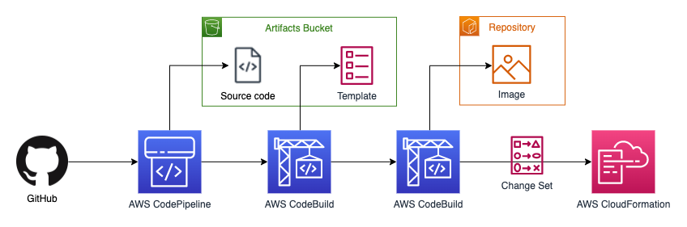

## Hello Go CDK

This is a sample project for AWS CDK development with Go.  It takes an http-based service listening on port 8080 and deploys to AWS as an Application Load Balanced Fargate Service.


## Prerequisites

You’ll need the following:

- An AWS account. If you don't already have one, follow the [Setting Up Your AWS Environment](https://aws.amazon.com/getting-started/guides/setup-environment/) getting started guide for a quick overview.
- The AWS Command Line Interface (AWS CLI) installed.  Visit [Set Up the AWS CLI](https://aws.amazon.com/getting-started/guides/setup-environment/module-three/) for instructions on installing and configuring.
- The AWS Cloud Development Kit (AWS CDK) installed.  Visit [Get Started with AWS CDK](https://aws.amazon.com/getting-started/guides/setup-cdk/?pg=gs&sec=gtkaws) for step-by-step instructions.
- Go 1.19 installed  You can [download a binary release](https://go.dev/dl/) suitable for your system.
- You can either use AWS CodeCommit as your git repository or create a GitHub repo along with an AWS CodeStar [GitHub connection](https://docs.aws.amazon.com/codepipeline/latest/userguide/connections-github.html). [Create a connection to GitHub](https://docs.aws.amazon.com/dtconsole/latest/userguide/connections-create-github.html) contains those instructions.
- Optional for HTTPS: A domain with a Route 53 [public hosted zone](https://docs.aws.amazon.com/Route53/latest/DeveloperGuide/AboutHZWorkingWith.html)

## Test HelloApp container

If you have docker installed, you can locally run the app by building and running a container.

```bash
cd HelloApp
docker build -t my-hellogo-app .
docker run -it --rm --name my-running-app -p 8080:8080 --user 1001 my-hellogo-app
```

In another terminal window, test by running a `curl` command and look for output `Hello, localtest!`

```bash
curl -w "\n" http://localhost:8080/localtest
```

## CDK deploy

### Customize deploy

The `cdk.context.json` allows you to customize the deploy using some parameters:

- `HelloGoPipelineStack:githubOrgRepo` - set to your GitHub "org/repo"
- `HelloGoPipelineStack:connectionArn` - set to the ARN of your [connection to GitHub](https://docs.aws.amazon.com/dtconsole/latest/userguide/connections-create-github.html) or blank to create an AWS CodeCommit repo
- `HelloGoAppStack:useHttps` - set to `true` to enable HTTPS (also requires domainName)
- `HelloGoAppStack:domainName` - domain name in Route53 public hosted zone for ALB listener (and ACM certificate)
- `HelloGoAppStack:hostedZoneId` - Route53 hosted zone ID for domain name above (allows TLS certificate to be provided by ACM)
- `HelloGoAppStack:certificateArn` optional TLS certificate imported into ACM

### Using GitHub

1. Create a GitHub private repository and [create a CodeStar connection to GitHub](https://docs.aws.amazon.com/dtconsole/latest/userguide/connections-create-github.html).

2. Push the code to your repo so the pipeline can find it later, replacing `{Your GitHub Org}` below.  Note: if you didn't `git clone` to download the project, you may need to run `git init` before these commands.

```bash
git remote add github git@github.com:{Your GitHub Org}/hello-go-cdk.git
git add .
git commit -m "initial commit"
git push github main
```

3. Deploy the pipeline, which might take 1-2 minutes.

```bash
cdk deploy
```


The `HelloAppCDKPipeline` will start executing after it is created.  This pipeline includes an [application stage](https://docs.aws.amazon.com/cdk/v2/guide/cdk_pipeline.html#cdk_pipeline_stages) which will create your Hello Go App stack when it runs the first time.  This might take 10 minutes to fully complete.



### Using AWS CodeCommit

If you don't want to use a GitHub repository, you can use AWS CodeCommit as your git repository.  Using [git-remote-codecommit](https://docs.aws.amazon.com/codecommit/latest/userguide/setting-up-git-remote-codecommit.html) is the recommended method for supporting connections made with federated access, identity providers, and temporary credentials.

Initial deployment might take 4-5 minutes.

```bash
cdk deploy
```

Your `HelloAppCDKPipeline` will have failed on the `Source` stage since source code has yet to be checked in to AWS CodeCommit.
In the snippet below, the `RepositoryURL` stack output value is exported to the `$REPO_URL` environment value.  Note: if you didn't `git clone` to download the project, you may need to run `git init` before these commands.

```bash
export REPO_URL=`aws cloudformation describe-stacks --stack-name HelloGoPipelineStack --query  "Stacks[0].Outputs[?OutputKey=='RepositoryURL'].OutputValue" --output text`
git remote add pipeline $REPO_URL
git add .
git commit -m "initial commit"
git push pipeline main
```

This will trigger another execution of `HelloAppCDKPipeline`, which should succeed.

*Note*: When changing values in `cdk.context.json`, you might see this issue -> https://github.com/aws/aws-cdk/issues/13759

## Test HelloGoApp service

In a terminal window, test the HelloGoApp service with the commands below and look for output `Hello, servicetest!`

```bash
export HELLO_GO_URL=`aws cloudformation describe-stacks --stack-name HelloGoAppStage-HelloGoAppStack --query  "Stacks[0].Outputs[?starts_with(OutputKey, 'FargateServiceServiceURL')].OutputValue" --output text`
curl -w "\n" $HELLO_GO_URL/servicetest
```

## Destroy Resources

When you're done with this demo app, be sure to destroy the resources it creates so you are not charged for what you're not using.  The Application Load Balanced Fargate Service creates a VPC with a NAT Gateway which costs ~$2 per day.  See [(ECS): VPC by default created with NAT #18720](https://github.com/aws/aws-cdk/issues/18720) for updates.


### Destroy the resources created with CDK

```bash
cdk destroy
```

### Destroy the resources created by the pipeline

You can delete the Application stack using the AWS CLI...

```bash
aws cloudformation delete-stack --stack-name HelloGoAppStage-HelloGoAppStack
```

...OR from the AWS Management Console:

1. Navigate to CloudFormation
2. Select the `HelloGoAppStage-HelloGoAppStack` stack
3. Select the Delete button and confirm

## Additional Links

- [Getting started with the AWS Cloud Development Kit and Go](https://aws.amazon.com/blogs/developer/getting-started-with-the-aws-cloud-development-kit-and-go/)
- [Working with the AWS CDK in Go](https://docs.aws.amazon.com/cdk/v2/guide/work-with-cdk-go.html)
- [AWS Cloud Development Kit Library](https://pkg.go.dev/github.com/aws/aws-cdk-go/awscdk/v2)
- [Build your Go image](https://docs.docker.com/language/golang/build-images/)
- [AWS CDK Intro Workshop > Go Workshop](https://cdkworkshop.com/60-go.html)

## Architectural Decisions

This sample uses the CDK construct for an Amazon ECS [Application Load Balanced Fargate Service](https://pkg.go.dev/github.com/aws/aws-cdk-go/awscdk/v2/awsecspatterns#readme-application-load-balanced-services) with configuration to support high availability across multiple availability zones.  This results in some resources that are "always on" and incurring costs.  If the usage pattern of your architecture could benefit from scaling down to zero, consider [building Lambda functions with Go](https://docs.aws.amazon.com/lambda/latest/dg/lambda-golang.html) for a serverless solution.

- From the [Amazon ECS Deployment types](https://docs.aws.amazon.com/AmazonECS/latest/developerguide/deployment-types.html), this sample uses the integrated ECS rolling update instead of a Blue/Green deployment with AWS CodeDeploy.
- The Application Load Balancer is configured for HTTP/1.1 as the [protocol version](https://docs.aws.amazon.com/elasticloadbalancing/latest/application/load-balancer-target-groups.html#target-group-protocol-version), but HTTP/2 or gRPC are available options.
- HTTPS is terminated on the Application Load Balancer using certificates from [AWS Certificate Manager](https://aws.amazon.com/certificate-manager/).  For end-to-end encryption, a certificate would need to be installed on the container and the Go code updated.
- This simple Go app doesn’t connect to AWS services nor have the [AWS SDK for Go](https://aws.amazon.com/sdk-for-go/) installed.  To grant AWS IAM permissions to AWS services, update the [Amazon ECS task execution IAM role](https://docs.aws.amazon.com/AmazonECS/latest/developerguide/task_execution_IAM_role.html).

## Security

See [CONTRIBUTING](CONTRIBUTING.md#security-issue-notifications) for more information.

## License

This library is licensed under the MIT-0 License. See the LICENSE file.
