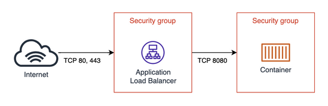

# Diagrams

The `HelloGoCDK.drawio` file contains a tab for each diagram.  To export these to `png` files, for each tab:

1. Select all
1. File - Export as PNG
1. Border Width: 20; check "Selection Only"
1. Use tab name as filename

## High Level Architecture

## CDK Deploy

## CDK Pipeline

## Application Load Balanced Fargate Service

## Security Groups

